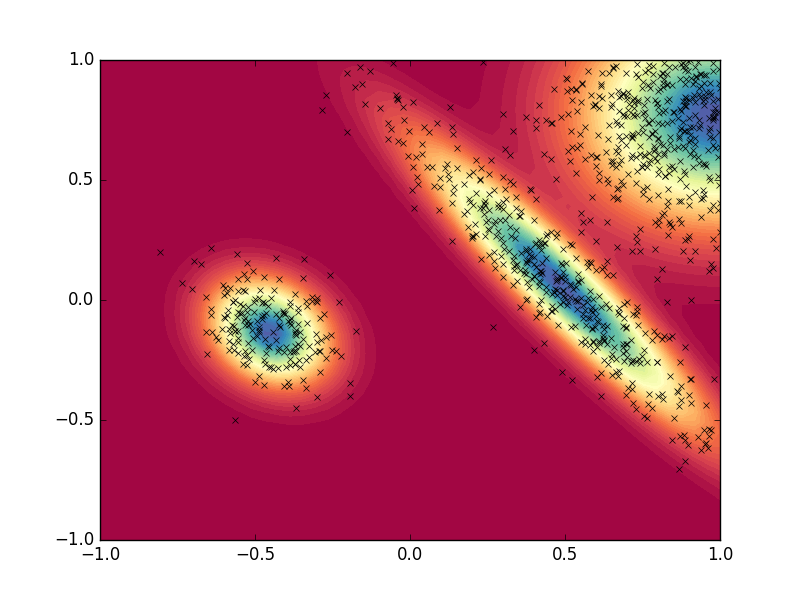

# Generate Random Numbers from a 2D Discrete Distribution

The `pinky` package is a Python implementation of Tristan Ursell's [matlab codes](https://www.mathworks.com/matlabcentral/fileexchange/35797-generate-random-numbers-from-a-2d-discrete-distribution/content/pinky.m), which simply given any real `N x M` probability matrix, can accurately sample the distribution.

### Basic Examples
```
from pinky import Pinky
```

For a given matrix distribution, `P`, we can initialize Pinky by...

```
p = Pinky(P=P)
```

We'll now give an example of generating a random distribution with 100 columns and 50 rows. First initialize an empty Pinky object.
```
p = Pinky()
```

Let's randomly create a distribution by summing 3 Gaussians. we'll randomly generate the location of `minima`, assign random widths `sigma`, and rotate the peaks by values `theta`.

```
n_peaks = 3
minima = np.random.uniform(-1, 1, size=(n_peaks, 2))
sigma = np.random.uniform(0.01, 0.5, size=(n_peaks, 2))
theta = np.random.uniform(-2*np.pi, 2*np.pi, size=(n_peaks))

p.Gaussian(minima=minima, sigma=sigma, theta=theta)
```

Using pinky this distribution can easily be discretely sampled a set number of times. Below we'll sample 1000 points and interpolate with a 10 fold resolution factor.

```
sampled_points = p.sample(1000, r=10)
```

Finally, let's plot the data

```
import matplotlib.pyplot as plt

fix,ax = plt.subplots()
ax.contourf(p.P, 50, cmap=plt.cm.Spectral, extent=p.extent)
ax.plot(sampled_points[:,0], sampled_points[:,1], 'x',
            color='k', markersize=5)
plt.show()
```


